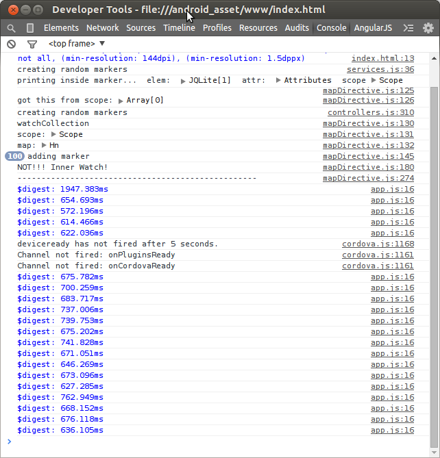

## Current experiments

Adding 100 markers changing 10% of them (Easily modifiable from line 7-8 of the js/controllers module). No code within each watch function...

## Results:

## Remote Debugging on Android with Chrome
Used this [link](https://developer.chrome.com/devtools/docs/remote-debugging#configure-webview) to enable remote debugging on my device.

I'm running this as a hybrid app within a webview. Ionic deals with the bundling of the app.

I'm running this app on my nexus 4 (Android 4.4.4 KitKat- kernel version 3.4.0-perf)

According to [this](https://developer.android.com/about/versions/kitkat.html) 
the information we have about the webview are the following:

Chromium WebView
===
Android 4.4 includes a completely new implementation of WebView that's based on Chromium. The new Chromium WebView gives you the latest in standards support, performance, and compatibility to build and display your web-based content.

Chromium WebView provides broad support for HTML5, CSS3, and JavaScript. It supports most of the HTML5 features available in Chrome for Android 30. It also brings an updated version of the JavaScript Engine (V8) that delivers dramatically improved JavaScript performance.

In addition, the new Chromium WebView supports remote debugging using Chrome DevTools. For example, you can use Chrome DevTools on your development machine to inspect, debug, and analyze your WebView content live on a mobile device.

The new Chromium WebView is included on all compatible devices running Android 4.4 and higher. You can take advantage of the new WebView right away, and with minimum modifications to existing apps and content. In most cases, your content will migrate to the new implementation seamlessly.

